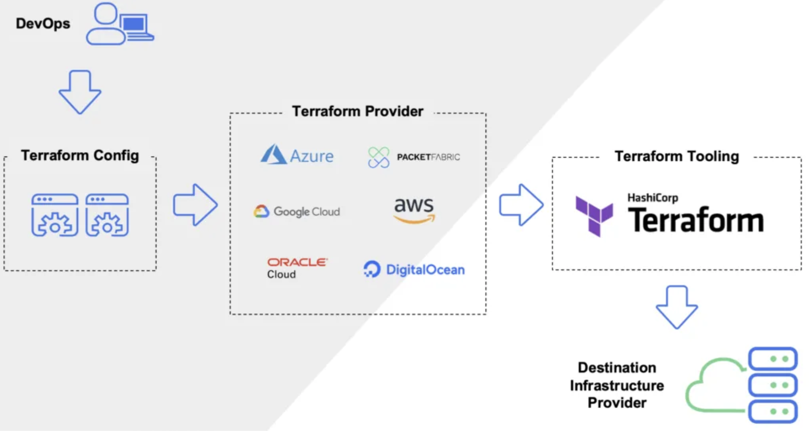

## Installation of Terraform
- Go to https://developer.hashicorp.com/terraform/install?product_intent=terraform
~~~
brew tap hashicorp/tap
brew install hashicorp/tap/terraform
~~~

## In Terraform, the key components include:
- **Providers**: Define the cloud providers or other services Terraform will interact with (e.g., AWS, Azure, GCP).
- **Variables**: Allow you to define input parameters for your Terraform configurations, which can be used to make your configurations more flexible and reusable.
- **Outputs**: Define the values that Terraform should return after creating the infrastructure. Outputs can be used to share information between different Terraform configurations or to make information accessible outside of Terraform.
- **Resources**: The most important component, representing the infrastructure objects like virtual machines, databases, and networking components.
- **Data Sources**: Allow you to fetch data from existing infrastructure or services that are not managed by Terraform.
- **Modules**: Packages of Terraform configurations that can be reused across different projects.
- **State**: Terraform uses state to keep track of the infrastructure it manages. The state file is used to map real-world resources to your configuration.

## First Application (.tf OR .tf.json)
- Create a .tf file with name first.tf
~~~hcl
output "hello" {
  value = "HelloWorld!!!"
}
~~~
- Create a .tf file with name first.tf
~~~json
{
    "output" : {
        "hello-json": {
            "value" : "HelloWorld!!!"
        }
    }
}

~~~

- Run `terraform plan` to review the changes
- Run `terraform apply` to execute changes


## Create a variable and take input from user

- Create outputs.tf and variable.tf file

### variable.tf
~~~hcl
variable output_1 {}
variable output_2 {}
~~~

### outputs.tf
~~~hcl
output "output_1" {
  value = var.output_1
}

output "output_2" {
  value = "Hello ${var.output_2}"
}
~~~
- Run `terraform plan` to review the changes
- Run `terraform apply` to execute changes

## Paas variable value from command prompt
~~~
terraform plan -var "output_1=Hi" -var "output_2=DJ"  
~~~


## Define Default value and dataType in variable
~~~hcl
variable output_1 {
    default = "DJ"
    type = string
}
variable output_2 {
    default = 12
    type = number
}

variable output_3 {
    default = [10, 20, 30]
    type = list
}
~~~


## How to use inbuilt functions in terraform
- https://developer.hashicorp.com/terraform/language/functions
~~~hcl

variable var_3 {
    default = ["Hello", "Hi"]
    type = list
}

variable var_4 {
    type = map
    default = {
        "DJ" : 10
    }
}


output "var_3" {
  value = "${join(" : ", var.var_3)}" # Hello : Hi
}

output "output_4" {
  value = "${upper(var.var_3[0])}" # "HELLO"
}


output "output_5" {
  value = lookup(var.var_4, "DJ") # 10
}
~~~

## Use of .tfvars file
- We can define default placeholder values with file name as `terraform.tfvars`
- We can define Variable values per environment in a different location like `variables/local.tfvars`
- If we are defining different file name other than `terraform.tfvars` then we need to paas that file as environment variable in CLI
- We can define a environment variable with prefix TF_VAR `export TF_VAR_name=DJ`

```
Fle: variables/local.tfvars
~~~
name = "Dhananjay"
~~~

File: outputs.tf
~~~
variable "name" {
  type = string
}

output "output_1" {
  value = var.name
}

~~~
> terraform plan -var-file=variables/local.tfvars                
```

## Terraform Architecture



## Use of providers in terraform
- https://registry.terraform.io/browse/providers
- https://registry.terraform.io/providers/integrations/github/latest/docs
- Get the PAT from Github setting >>developer setting >> personal access token

File: providers.tf
~~~
provider "github" {
    token = "<PAT_TOKEN>"
}


resource "github_repository" "terraform-repo-creation-ref" {
  name        = "terraform-example"
  description = "terraform basics"
  visibility = "public"
  auto_init = true
}

resource "github_repository" "terraform-repo-creation-ref_1" {
  name        = "terraform-example_1"
  description = "terraform basics"
  visibility = "public"
  auto_init = true
}
~~~

**Run below commands**
```
> terraform init
> terraform validate   
> terraform plan      
> terraform providers
> terraform apply --auto-approve
> terraform destroy --auto-approve


# Run below command Destroy any specific resource             
> terraform destroy --target github_repository.terraform-repo-ref_1 --auto-approve
```

## Use of Terraform Refresh
- This will refresh the state file with remote resources
- To see the state file using cmd `terraform show`
~~~
> terraform refresh
~~~

## How to get a value of output
~~~
> terraform output <output_name>
~~~

## How to get a value of variable in local debugging using command
~~~
> terraform console
  > var.GIT_REPO_1
~~~

## How to format the code using command
~~~
> terraform fmt
~~~


